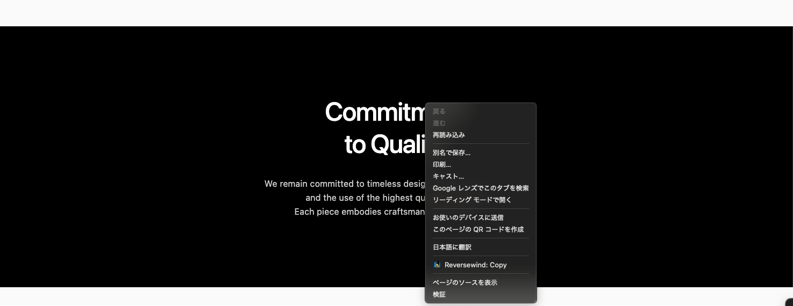
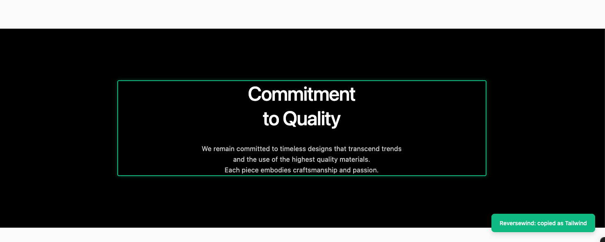
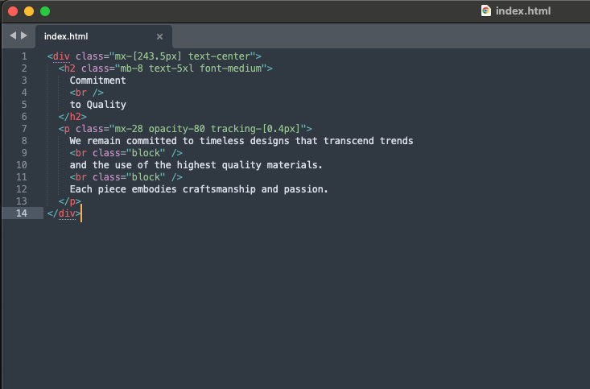

# Reversewind

Right-click any element on a web page and instantly copy it as clean HTML with Tailwind CSS classes.





## Features

- Converts computed styles to Tailwind utility classes
- Preserves SVG elements with all attributes intact
- Supports flex, grid, spacing, colors, typography, borders, shadows, and more
- Falls back to inline styles for properties that can't be expressed in Tailwind
- Highlights the copied element so you always know what was captured
- No data collection, no external requests — everything runs locally

## Install

### Chrome Web Store

[Install from Chrome Web Store](https://chromewebstore.google.com/detail/reversewind/nacafidpnkedkhhefdpkhjcijdabgolj)

### Manual (Developer Mode)

```bash
git clone https://github.com/t09tanaka/reversewind.git
cd reversewind
npm install
npm run build
```

1. Open `chrome://extensions`
2. Enable **Developer mode**
3. Click **Load unpacked** and select the `dist/` folder

## Usage

1. Right-click any element on a web page
2. Select **Reversewind: Copy**
3. Paste the generated HTML + Tailwind CSS code anywhere

## Development

```bash
npm run dev          # Watch mode
npm run build        # Production build
npm run test         # Run tests
npm run lint         # Lint
npm run typecheck    # Type check
```

## Privacy

Reversewind does not collect, store, or transmit any data. See [Privacy Policy](PRIVACY.md).

## License

[MIT](LICENSE)
